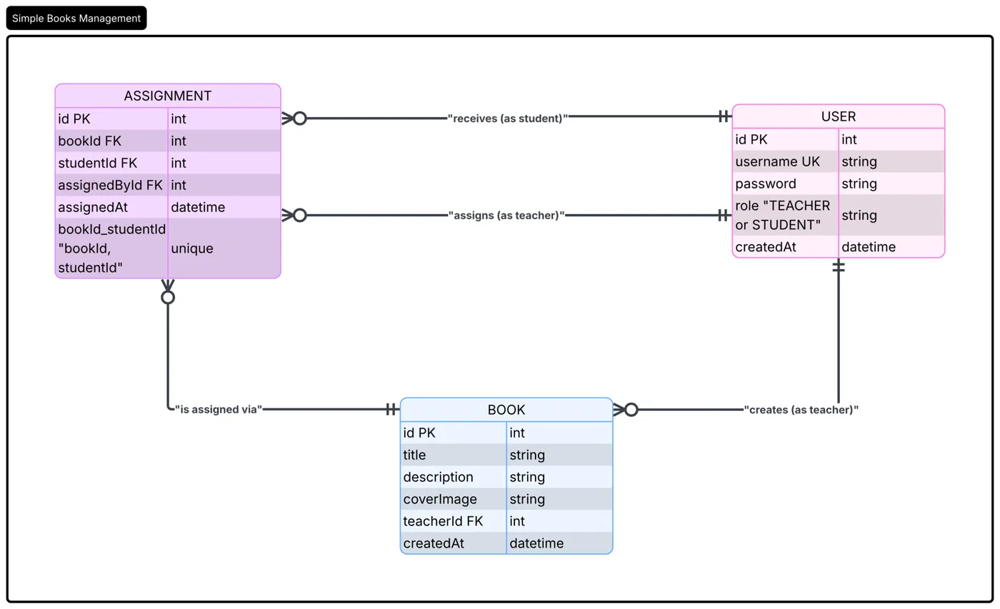

# Books Management (CRUD) — Technical Interview Submission

This repository was built as a technical assessment for an internship application. It implements a simple books management system with role-based access (Teacher / Student).

## Spec

- Users log in using username and password.
- Two roles: **Teacher** and **Student**.
- **Teacher:** create books (title, description, cover image), assign books to students. A teacher cannot assign the same book to the same student more than once.
- **Student:** view books that have been assigned to them.

## Structure (monorepo)

```
apps/
├── api/     → NestJS backend (Prisma + PostgreSQL)
└── web/     → React frontend (MVVM structure)
```

## Activities completed

1. ERD — see `apps/api/prisma` schema and diagram
2. PostgreSQL database
3. Prisma schema and migration
4. NestJS backend API
5. React frontend (MVVM: models / viewmodels / views)
6. Pushed to GitHub

# ERD Diagram

Link to diagram:


Preview:

